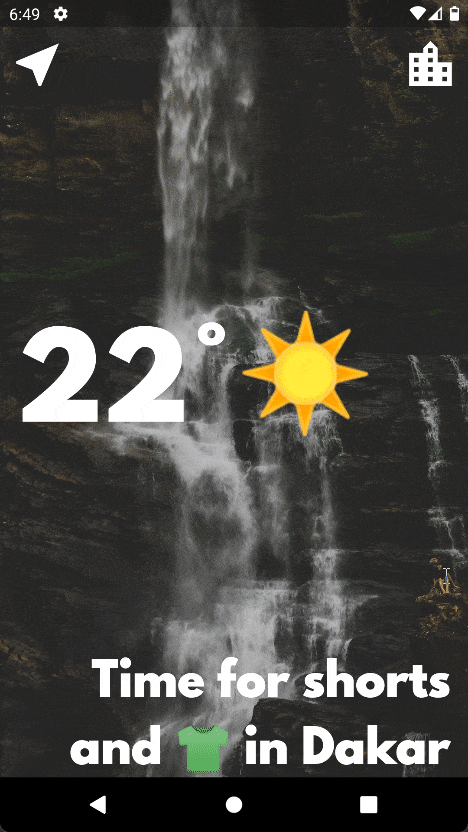

<h1 align="center">Clima</h1>

## 🏁Description

<div style="text-align: justify">Clima is a Weather Cross-Platform Mobile App built with Flutter. Users can have ambiant temperature and advices based on their location.</div>



## ⛏️Built With

- [Dart](https://dart.dev/) - A client-optimized language for developing fast apps on any platform.
- [Flutter](https://flutter.dev/) - An open source framework by Google for building beautiful, natively compiled, multi-platform applications from a single codebase.
- [OpenWeather API](https://openweathermap.org/api) - Weather forecasts, nowcasts and history in fast and elegant way.

## ⛓️Prerequisites

- [Flutter SDK](https://docs.flutter.dev/get-started/install) v2.8.1 or higher
- [Android](https://developer.android.com/studio) or [iOS dev environment](https://developer.apple.com/xcode/)

## 🚀Run

#### Clone repository

```
git clone https://github.com/MisterRoy/clima.git
```

#### Install dependencies

```
flutter pub get
```

#### Launch

```
flutter run
```

## 👨🏾‍💻Authors

- [Mr. Roy](https://github.com/MisterRoy)

## 👋🏿Acknowledgments

- [Angela Yu](https://github.com/angelabauer)
- Flutter Team at Google
- All authors of the differents pub packages used in this project
